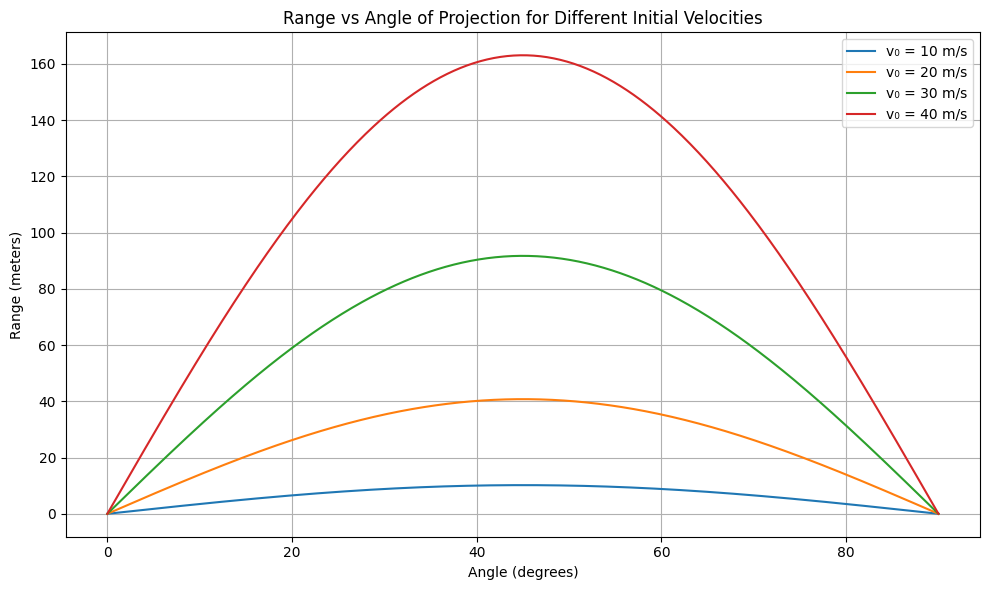

# Problem 1
#📘 Projectile Motion: Investigating Range as a Function of Angle
#🎯 1. Theoretical Background

Projectile motion describes the motion of an object thrown into the air, subject only to gravitational acceleration.

#🧮 Equations of Motion

The motion is broken into two components:

1.Horizontal (x-axis)

2.Vertical (y-axis)

#Initial velocity components:

$v_{0x} = v_0 \cos(\theta)$

$v_{0y} = v_0 \sin(\theta)$

Position functions:

$x(t) = v_0 \cos(\theta) \cdot t$

$y(t) = v_0 \sin(\theta) \cdot t - \frac{1}{2} g t^2$

#⏱️ Time of Flight

For a projectile launched and landing at the same height:

$T = \frac{2v_0 \sin(\theta)}{g}$

#📏 Horizontal Range

Using time of flight in the x-position:

$R = v_{0x} \cdot T$

$R = \frac{v_0^2 \sin(2\theta)}{g}$

Range is maximum when $\theta = 45^\circ$ because $\sin(2\theta)$ is maximum at $90^\circ$.

#📊 2. Detailed Python Simulation
💡 Objective

Simulate and visualize how the range changes with projection angle. Also show effects of varying initial speed and gravity.

```Python
import numpy as np
import matplotlib.pyplot as plt

# Define function to calculate range
def calculate_range(v0, g, angles_deg):
    angles_rad = np.radians(angles_deg)
    return (v0**2 * np.sin(2 * angles_rad)) / g

# Parameters
g = 9.81  # Earth gravity (m/s^2)
angles = np.linspace(0, 90, 500)

# Different initial speeds
v0_values = [10, 20, 30, 40]

plt.figure(figsize=(10, 6))

# Plot for each v0
for v0 in v0_values:
    R = calculate_range(v0, g, angles)
    plt.plot(angles, R, label=f'v₀ = {v0} m/s')

plt.title("Range vs Angle of Projection for Different Initial Velocities")
plt.xlabel("Angle (degrees)")
plt.ylabel("Range (meters)")
plt.grid(True)
plt.legend()
plt.tight_layout()
plt.show()
```
🔍 3. Parameters and Their Effects
<table>
  <thead>
    <tr>
      <th>Parameter</th>
      <th>Symbol</th>
      <th>Effect on Range</th>
    </tr>
  </thead>
  <tbody>
    <tr>
      <td>Initial Velocity</td>
      <td>$v_0$</td>
      <td>$R \propto v_0^2$ → Quadratic increase</td>
    </tr>
    <tr>
      <td>Gravity</td>
      <td>$g$</td>
      <td>$R \propto \frac{1}{g}$ → Inversely related</td>
    </tr>
    <tr>
      <td>Angle</td>
      <td>$\theta$</td>
      <td>$R \propto \sin(2\theta)$ → Max at $45^\circ$</td>
    </tr>
  </tbody>
</table>

#🌐 4. Real-World Adaptations
#🏔 Uneven Terrain
If the launch and landing heights differ (e.g., launched from a cliff or building), the vertical motion equation becomes:

$$
y(t) = v_0 \sin(\theta)t - \frac{1}{2}gt^2
$$

$$
y(t) = v_0 \sin(\theta)t - \frac{1}{2}gt^2
$$

#💨 With Air Resistance
Introduce drag force: $F_d = -kv$ (linear) or $F_d = -kv^2$ (quadratic)

Requires numerical methods (Euler, Runge-Kutta)

Not analytically solvable in closed form

#🚧 6. Limitations & Future Improvements
<table>
  <thead>
    <tr>
      <th>Limitation</th>
      <th>How to Improve</th>
    </tr>
  </thead>
  <tbody>
    <tr>
      <td>No air resistance</td>
      <td>Add drag force and solve numerically</td>
    </tr>
    <tr>
      <td>Constant gravity</td>
      <td>Use variable $g(h)$ for high-altitude launches</td>
    </tr>
    <tr>
      <td>Flat terrain</td>
      <td>Model terrain using piecewise height functions</td>
    </tr>
    <tr>
      <td>2D only</td>
      <td>Extend to 3D with azimuthal angle for full realism</td>
    </tr>
  </tbody>
</table>

✅ Conclusion
Projectile motion is a powerful model that reveals deep physical insights using relatively simple mathematics. By changing angle, speed, and environment, we unlock a vast space of real-world applications — from sports to space science.

