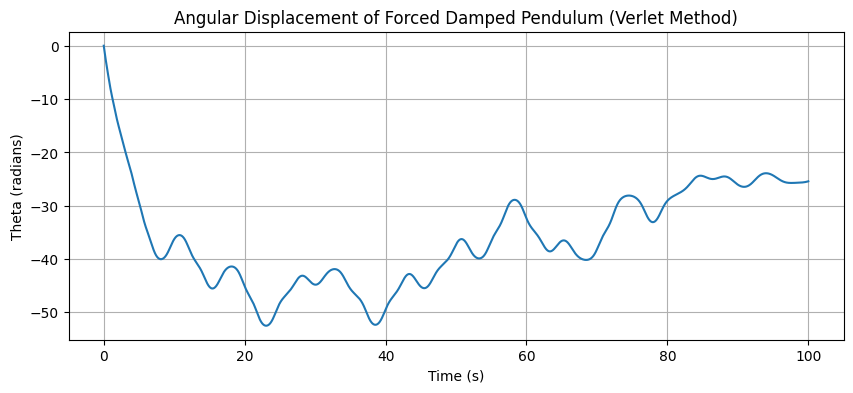

# Problem 2
#🌀 Investigating the Dynamics of a Forced Damped Pendulum

#📌 Motivation
The forced damped pendulum illustrates how the simple motion of a pendulum becomes drastically more complex when damping and external forcing are introduced. These interactions give rise to phenomena such as:

#Resonance
##A phenomenon where a system oscillates at maximum amplitude when driven at its natural frequency.

#Quasiperiodic Motion
##Motion that results from the combination of two or more incommensurate frequencies, leading to a complex but non-chaotic behavior.

#Chaos
##A state of unpredictable, irregular motion that occurs when a system is highly sensitive to initial conditions, often seen when driving forces are close to resonant frequencies.

#Applications of this model span:
Climate Systems: Understanding complex cycles and feedback loops within climate dynamics.

##Oscillating Circuits: Used in electrical engineering, particularly in resonance circuits.

##Energy Harvesting: Devices like piezoelectric generators, where oscillating systems harvest energy from environmental vibrations.

##Structural Dynamics: Studying vibrations and oscillations in structures such as bridges, buildings, and mechanical systems.

---

🧠 1. Theoretical Foundation

🔧 Governing Equation
The equation of motion for a forced, damped pendulum is:
$$
\frac{d^2\theta}{dt^2} + \gamma \frac{d\theta}{dt} + \omega_0^2 \sin(\theta) = A \cos(\omega t)
$$
Where:

$\theta(t)$: Angular displacement

$\gamma$: Damping coefficient

$\omega_0$: Natural frequency $(\omega_0 = \sqrt{g/L})$

$A$: Amplitude of the driving force

$\omega$: Driving frequency

✅ Small-Angle Approximation

If $\theta$ is small:
$$
\sin(\theta) \approx \theta
$$

$$
\Rightarrow \frac{d^2\theta}{dt^2} + \gamma \frac{d\theta}{dt} + \omega_0^2 \theta = A \cos(\omega t)
$$
This is a linear second-order differential equation solvable using standard methods (e.g., undetermined coefficients).

---

📊 2. Analysis of Dynamics

🔁 Parameter Influence
<table>
  <thead>
    <tr>
      <th>Parameter</th>
      <th>Symbol</th>
      <th>Effect</th>
    </tr>
  </thead>
  <tbody>
    <tr>
      <td>Damping</td>
      <td>&gamma;</td>
      <td>Reduces amplitude, suppresses chaos at high values</td>
    </tr>
    <tr>
      <td>Driving amplitude</td>
      <td>A</td>
      <td>Higher A can induce chaotic behavior</td>
    </tr>
    <tr>
      <td>Driving frequency</td>
      <td>&omega;</td>
      <td>Controls resonance and synchronization</td>
    </tr>
  </tbody>
</table>
---

🔄 Regular vs. Chaotic Motion
At low forcing: periodic or quasiperiodic motion

At certain parameter ranges: chaotic behavior, sensitive to initial conditions

Visual tools: Phase space, Poincaré sections, Bifurcation diagrams

🌍 3. Practical Applications
The forced damped pendulum model applies to many real systems:
<table>
  <thead>
    <tr>
      <th>Field</th>
      <th>Example</th>
    </tr>
  </thead>
  <tbody>
    <tr>
      <td>Mechanical</td>
      <td>Suspension bridges, vibration absorbers</td>
    </tr>
    <tr>
      <td>Electrical</td>
      <td>Driven RLC circuits</td>
    </tr>
    <tr>
      <td>Biomechanics</td>
      <td>Human locomotion (gait dynamics)</td>
    </tr>
    <tr>
      <td>Renewable energy</td>
      <td>Pendulum wave energy converters</td>
    </tr>
  </tbody>
</table>

---


🐍 Python Code

```Python
import numpy as np
import matplotlib.pyplot as plt

# Parameters
gamma = 0.2        # damping coefficient
omega0 = 1.5       # natural frequency
A = 1.2            # driving amplitude
omega = 0.8        # driving frequency

# Time parameters
t_max = 100        # maximum time
dt = 0.01          # time step
n_steps = int(t_max / dt)  # number of time steps

# Initial conditions
theta_0 = 0.1      # initial angle (radians)
v_0 = 0.0          # initial angular velocity

# Initialize arrays to store results
t = np.linspace(0, t_max, n_steps)
theta = np.zeros(n_steps)
v = np.zeros(n_steps)

# Set initial conditions
theta[0] = theta_0
v[0] = v_0

# Verlet method to solve the equations
for i in range(1, n_steps-1):
    # Compute the acceleration at current position
    a = -gamma * v[i-1] - omega0**2 * np.sin(theta[i-1]) + A * np.cos(omega * t[i-1])
    
    # Use the Verlet update rule
    theta[i+1] = 2 * theta[i] - theta[i-1] + a * dt**2
    v[i+1] = (theta[i+1] - theta[i-1]) / (2 * dt)  # Velocity is the derivative of position

# Plot the results
plt.figure(figsize=(10, 4))
plt.plot(t, theta)
plt.title("Angular Displacement of Forced Damped Pendulum (Verlet Method)")
plt.xlabel("Time (s)")
plt.ylabel("Theta (radians)")
plt.grid(True)
plt.show()
```
 

---

⚠️ Limitations and Extensions
<table>
  <thead>
    <tr>
      <th>Limitation</th>
      <th>Suggested Extension</th>
    </tr>
  </thead>
  <tbody>
    <tr>
      <td>Small-angle approximation</td>
      <td>Use full &sin;(&theta;) for large oscillations</td>
    </tr>
    <tr>
      <td>Linear damping only</td>
      <td>Add nonlinear damping terms</td>
    </tr>
    <tr>
      <td>Periodic forcing only</td>
      <td>Try quasiperiodic or random driving</td>
    </tr>
    <tr>
      <td>2D model</td>
      <td>Extend to double pendulum or 3D</td>
    </tr>
  </tbody>
</table>

---

#Conclusion:
The forced damped pendulum model offers valuable insights into the behavior of oscillating systems, ranging from simple harmonic motion to chaotic dynamics. By studying phenomena such as resonance, quasiperiodic motion, and chaos, this model provides a framework for understanding complex real-world systems. Its applications span various fields, including climate systems, oscillating circuits, energy harvesting, and structural dynamics, making it a versatile tool for both theoretical analysis and practical engineering solutions.
