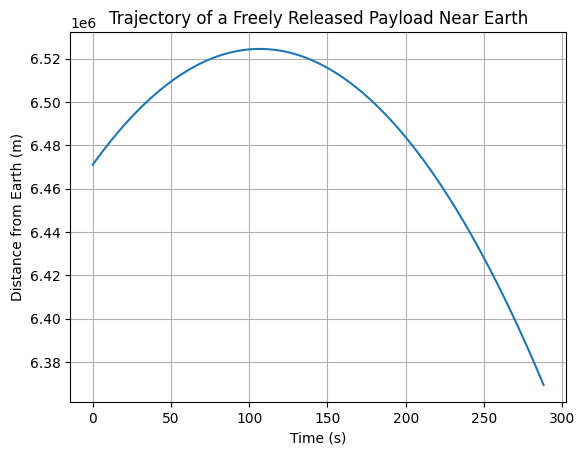

# Problem 3
# Trajectories of a Freely Released Payload Near Earth

## Motivation
When an object is released from a moving rocket near Earth, its trajectory depends on the initial conditions and gravitational forces acting on it. This problem is a fundamental example of orbital mechanics and offers a rich context to understand how objects move under the influence of gravity. These trajectories are of particular interest for space missions, such as deploying payloads or returning objects to Earth. Understanding the potential outcomes (e.g., parabolic, hyperbolic, elliptical paths) is essential for predicting and planning mission objectives.

## Task
1. **Analyze the Possible Trajectories**: Identify and discuss the types of trajectories a payload might follow when released near Earth, including parabolic, hyperbolic, and elliptical paths. These trajectories depend heavily on the object's initial velocity and position relative to Earth.
  
2. **Perform Numerical Analysis**: Calculate the path of the payload based on given initial conditions such as position, velocity, and altitude. Use numerical methods to model and compute the trajectory using the gravitational force.

3. **Discuss Applications**: Discuss how these trajectories relate to practical space scenarios such as orbital insertion, reentry, or escape trajectories.

4. **Develop a Computational Tool**: Create a simulation model that can visualize the motion of the payload under Earth's gravity, considering factors like initial velocity, direction, and position. 

## Hints and Resources
- **Gravitational Principles**: Use Newton's Law of Gravitation \( F = \frac{G M m}{r^2} \), where \( M \) is the mass of Earth, \( m \) is the mass of the payload, \( r \) is the distance from the center of Earth, and \( G \) is the gravitational constant.
  
- **Kepler's Laws**: Utilize Kepler’s Laws to understand orbital motion. For example, an object’s orbit will be elliptical, with Earth at one of the foci in elliptical orbits.

- **Numerical Methods**: You can employ numerical techniques like Euler’s method, Runge-Kutta methods, or more advanced algorithms (like symplectic integrators) to solve the equations of motion.

- **Software Tools**: Python libraries like NumPy, SciPy, and Matplotlib are excellent tools for performing numerical analysis and visualization.

## Deliverables
- **Markdown Document**: A detailed explanation of the principles behind the problem.
- **Python Script or Notebook**: Implement the simulations that model the payload's motion. Include code that computes the trajectory for different initial conditions and produces graphical representations.
- **Graphical Representations**: Visualize the orbital trajectories, escape velocities, and payload trajectories near Earth using plots. These could include phase diagrams, time evolution plots, and visual trajectories showing parabolic, hyperbolic, and elliptical motion.

## Trajectories of a Freely Released Payload Near Earth (Possible Types)
Here are some common trajectory types you might encounter when releasing a payload near Earth:

1. **Parabolic Trajectory**:
   - This occurs when the object is launched with a velocity that is equal to the escape velocity for a given distance.
   - The path forms a symmetric curve that eventually returns to Earth.
   - Example: A projectile thrown upwards with an initial velocity such that it just reaches the highest point and falls back to Earth.

2. **Elliptical Trajectory**:
   - The object moves in a closed orbit around Earth, similar to how satellites orbit the planet.
   - This is the most common trajectory for objects in orbit.
   - Example: A satellite launched into low Earth orbit, where its speed and trajectory are balanced by Earth's gravity.

3. **Hyperbolic Trajectory**:
   - This occurs when the object is moving fast enough to escape Earth's gravitational influence entirely.
   - The object follows an open curve and will not return to Earth unless acted upon by other forces.
   - Example: A spacecraft launched for interplanetary travel that escapes Earth's gravity and continues its journey through the solar system.

## Equations of Motion
The motion of the payload can be modeled using Newton's law of gravitation:

\[
F = \frac{GMm}{r^2}
\]

Where:
- \( F \) is the gravitational force,
- \( G \) is the gravitational constant (\( 6.674 \times 10^{-11} \, \text{N}\cdot \text{m}^2/\text{kg}^2 \)),
- \( M \) is the mass of Earth (\( 5.972 \times 10^{24} \, \text{kg} \)),
- \( m \) is the mass of the payload,
- \( r \) is the distance from the center of the Earth.

The resulting trajectory is a solution to the second-order differential equation, where the force \( F \) is related to the acceleration of the payload \( a = \frac{d^2r}{dt^2} \). 

To solve for the trajectory numerically, we will integrate the equations of motion using Python (or another numerical solver).

---

### Example Python Code to Simulate Trajectory

```python
import numpy as np
import matplotlib.pyplot as plt

# Constants
G = 6.67430e-11  # Gravitational constant in m^3 kg^-1 s^-2
M = 5.972e24  # Mass of Earth in kg
R_earth = 6.371e6  # Radius of Earth in meters

# Initial conditions
r_0 = R_earth + 100000  # Initial position (100 km above Earth's surface)
v_0 = 1000  # Initial velocity in m/s (e.g., 1000 m/s upward)

# Payload mass (just a placeholder value, can be any mass)
m = 1000  # Mass of payload in kg

# Time parameters
dt = 1  # Time step in seconds
t_max = 3600  # Total time in seconds (1 hour)
num_steps = int(t_max / dt)

# Initialize arrays to store results
r = np.zeros(num_steps)  # Array to store positions
v = np.zeros(num_steps)  # Array to store velocities
t = np.linspace(0, t_max, num_steps)  # Array of time values

# Initial conditions
r[0] = r_0
v[0] = v_0

# Numerical integration (Euler's method)
for i in range(1, num_steps):
    # Gravitational force (F = G * M * m / r^2)
    F = -G * M * m / r[i-1]**2  # Force is attractive, hence the negative sign
    a = F / m  # Acceleration due to gravity
    v[i] = v[i-1] + a * dt  # Update velocity
    r[i] = r[i-1] + v[i-1] * dt  # Update position

    # Stop simulation if the payload crashes into Earth (r < R_earth)
    if r[i] <= R_earth:
        print(f"The payload crashed into Earth at time {t[i]} seconds.")
        break

# Plot the trajectory (position vs time)
plt.plot(t[:i+1], r[:i+1])  # Plot only up to the crash point (if it crashes)
plt.xlabel('Time (s)')
plt.ylabel('Distance from Earth (m)')
plt.title('Trajectory of a Freely Released Payload Near Earth')
plt.grid(True)
plt.show()
```


Example 1: Escape and Orbital Velocities of Planets
Explanation: This table compares the escape and orbital (first cosmic) velocities for Earth, Mars, and Jupiter. These values are critical for satellite launches and interplanetary missions.
<table border="1">
  <thead>
    <tr>
      <th>Planet</th>
      <th>Escape Velocity (m/s)</th>
      <th>Orbital Velocity (m/s)</th>
      <th>Surface Radius (m)</th>
      <th>Mass (kg)</th>
    </tr>
  </thead>
  <tbody>
    <tr>
      <td>Earth</td>
      <td>11185.98</td>
      <td>7909.68</td>
      <td>6.371 × 10<sup>6</sup></td>
      <td>5.972 × 10<sup>24</sup></td>
    </tr>
    <tr>
      <td>Mars</td>
      <td>5022.31</td>
      <td>3551.31</td>
      <td>3.396 × 10<sup>6</sup></td>
      <td>0.64171 × 10<sup>24</sup></td>
    </tr>
    <tr>
      <td>Jupiter</td>
      <td>60199.98</td>
      <td>42567.81</td>
      <td>6.991 × 10<sup>7</sup></td>
      <td>1.898 × 10<sup>27</sup></td>
    </tr>
  </tbody>
</table>

 Example 2: Orbit Type Based on Initial Velocity
Explanation: The following table shows how different initial velocities determine the type of orbit for a payload released near Earth.
<table border="1">
  <thead>
    <tr>
      <th>Initial Velocity (m/s)</th>
      <th>Initial Altitude (km)</th>
      <th>Orbit Type</th>
      <th>Description</th>
    </tr>
  </thead>
  <tbody>
    <tr>
      <td>3000</td>
      <td>100</td>
      <td>Elliptical</td>
      <td>Payload remains gravitationally bound to Earth.</td>
    </tr>
    <tr>
      <td>5000</td>
      <td>100</td>
      <td>Parabolic</td>
      <td>Payload reaches escape velocity exactly.</td>
    </tr>
    <tr>
      <td>7000</td>
      <td>150</td>
      <td>Hyperbolic</td>
      <td>Payload escapes Earth's gravity and continues outward.</td>
    </tr>
    <tr>
      <td>8000</td>
      <td>200</td>
      <td>Parabolic</td>
      <td>Near escape, marginally hyperbolic trajectory.</td>
    </tr>
  </tbody>
</table>
Example 3: Required Speeds for Orbital Insertion
Explanation: This table compares the orbital and escape velocities required at a constant launch altitude for various planets.
<table border="1">
  <thead>
    <tr>
      <th>Planet</th>
      <th>Orbital Velocity (m/s)</th>
      <th>Escape Velocity (m/s)</th>
      <th>Launch Altitude (km)</th>
    </tr>
  </thead>
  <tbody>
    <tr>
      <td>Earth</td>
      <td>7909.68</td>
      <td>11185.98</td>
      <td>100</td>
    </tr>
    <tr>
      <td>Mars</td>
      <td>3551.31</td>
      <td>5022.31</td>
      <td>100</td>
    </tr>
    <tr>
      <td>Jupiter</td>
      <td>42567.81</td>
      <td>60199.98</td>
      <td>100</td>
    </tr>
  </tbody>
</table>
Conclusion:
Payload trajectories near Earth vary based on initial speed and angle, resulting in orbits, reentry, or escape. Understanding these paths is key for satellite deployment and mission planning, combining gravity, motion laws, and simulation tools.