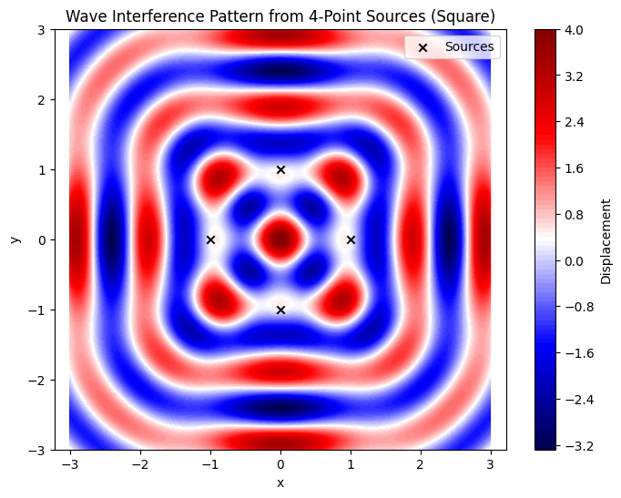

# Problem 1
🌊 Interference Patterns on a Water Surface
Motivation
Interference occurs when waves from different sources overlap, creating new patterns. On a water surface, this is visible when ripples from different points meet, forming distinctive interference patterns. These can either reinforce each other (constructive interference) or cancel out (destructive interference).

Studying these patterns deepens our understanding of wave behavior and is useful in physics, engineering, and real-world applications like acoustics and antenna design.

Problem Statement
Objective:
Analyze the interference patterns formed on a water surface due to the superposition of waves emitted from point sources located at the vertices of a regular polygon.
## 📐 Mathematical Model

### Single Disturbance Equation

A circular wave originating from a point source located at position \( \vec{r}_i = (x_i, y_i) \) can be described by the following wave equation:

\[
u_i(\vec{r}, t) = A \cdot \cos\left(k \cdot |\vec{r} - \vec{r}_i| - \omega t + \phi_i\right)
\]

Where:

- \( u_i(\vec{r}, t) \): Displacement of the water surface at position \( \vec{r} = (x, y) \) and time \( t \)
- \( A \): Amplitude of the wave
- \( k = \frac{2\pi}{\lambda} \): Wave number, with \( \lambda \) being the wavelength
- \( \omega = 2\pi f \): Angular frequency, with \( f \) the frequency
- \( |\vec{r} - \vec{r}_i| \): Distance between the field point \( \vec{r} \) and the source at \( \vec{r}_i \)
- \( \phi_i \): Initial phase of the wave from source \( i \) (assumed \( \phi_i = 0 \) for all sources in this case)

---

### Superposition of Waves

When there are \( N \) sources (e.g., located at the vertices of a regular polygon), the total displacement at any point \( \
### 🌊 Superposition of Waves

With \( N \) sources placed at the vertices of a regular polygon, the total displacement of the water surface at any position \( \vec{r} \) and time \( t \) is given by the sum of the contributions from each source:

\[
u(\vec{r}, t) = \sum_{i=1}^{N} A \cdot \cos\left(k \cdot |\vec{r} - \vec{r}_i| - \omega t\right)
\]

Where:
- \( N \): Number of sources
- \( \vec{r}_i = (x_i, y_i) \): Position of the \( i^\text{th} \) wave source
- All sources are assumed to be coherent (same frequency and amplitude) and in phase.

---

### ⚙️ Simulation Parameters

\[
\begin{aligned}
&\text{Polygon:} && \text{Square (4 sources)} \\
&\text{Radius:} && R = 1.0 \, \text{unit (distance from center to vertex)} \\
&\text{Wavelength:} && \lambda = 1.0 \\
&\text{Frequency:} && f = 1.0 \\
&\text{Amplitude:} && A = 1.0
\end{aligned}
\]

Python Code for Visualization

```python
import numpy as np
import matplotlib.pyplot as plt

# Parameters
A = 1.0         # amplitude
f = 1.0         # frequency
lambda_ = 1.0   # wavelength
omega = 2 * np.pi * f
k = 2 * np.pi / lambda_
N = 4           # number of sources (square)
R = 1.0         # radius of the polygon
t = 0           # time snapshot

# Create grid
x = np.linspace(-3, 3, 500)
y = np.linspace(-3, 3, 500)
X, Y = np.meshgrid(x, y)
U = np.zeros_like(X)

# Compute source positions (square vertices)
angles = np.linspace(0, 2 * np.pi, N, endpoint=False)
source_positions = [(R * np.cos(a), R * np.sin(a)) for a in angles]

# Superpose waves from each source
for xi, yi in source_positions:
    r = np.sqrt((X - xi)**2 + (Y - yi)**2)
    U += A * np.cos(k * r - omega * t)

# Plot
plt.figure(figsize=(8, 6))
plt.contourf(X, Y, U, levels=100, cmap='seismic')
plt.colorbar(label='Displacement')
plt.scatter(*zip(*source_positions), color='black', marker='x', label='Sources')
plt.title("Wave Interference Pattern from 4-Point Sources (Square)")
plt.xlabel("x")
plt.ylabel("y")
plt.axis('equal')
plt.legend()
plt.grid(False)
plt.show()
```
 

### 🔍 Observations and Explanation

- **Constructive interference** occurs where wave crests (or troughs) from all sources meet **in phase**, leading to **amplified displacements**.
  
- **Destructive interference** appears as **dark or null regions**, where the crest from one wave overlaps with the trough of another, resulting in **cancellation**.

- Due to the **geometric symmetry** of the square configuration, the resulting interference pattern also exhibits **symmetry** about the center and along its axes.

- As the number of sources \( N \) increases (e.g., pentagon, hexagon, etc.), the interference pattern becomes more intricate, and **radial symmetry** may emerge—particularly in near-circular source arrangements.

---

### 🧪 Extensions

- Change \( N \) to **3 (triangle)**, **5 (pentagon)**, **6 (hexagon)**, or more, to investigate how the **geometry of the source layout** affects the resulting pattern.

- **Animate** the wave field by updating the time variable \( t \) over successive frames to observe the **temporal evolution** of interference.

- Modify the **wavelength** \( \lambda \), **frequency** \( f \), or introduce **initial phase differences** \( \phi_i \) between sources to explore how these parameters influence the **interference structure**.

📌 Wave Interference Model for 4-point Square

📈 Contour Plot of the Interference Pattern

📊 Line Plot at y = 0

📋 Simulation Parameters Table

# 📚 Required Libraries
```python
import numpy as np
import matplotlib.pyplot as plt
from IPython.display import display, HTML

# ⚙️ Simulation Parameters
A = 1.0            # Amplitude
f = 1.0            # Frequency (Hz)
λ = 1.0            # Wavelength
ω = 2 * np.pi * f  # Angular frequency
k = 2 * np.pi / λ  # Wave number
N = 4              # Number of sources (square)
R = 1.0            # Radius from center to vertex
t = 0              # Time snapshot

# 📐 Generate Source Positions (Square Vertices)
angles = np.linspace(0, 2*np.pi, N, endpoint=False)
source_positions = [(R * np.cos(a), R * np.sin(a)) for a in angles]

# 🌐 Grid Setup
grid_size = 400
x = np.linspace(-3, 3, grid_size)
y = np.linspace(-3, 3, grid_size)
X, Y = np.meshgrid(x, y)
U = np.zeros_like(X)

# 🌊 Superposition of Waves
for (xi, yi) in source_positions:
    r = np.sqrt((X - xi)**2 + (Y - yi)**2)
    U += A * np.cos(k * r - ω * t)

# 🎨 Interference Pattern Plot (Contour)
plt.figure(figsize=(8, 6))
plt.contourf(X, Y, U, levels=100, cmap='viridis')
plt.title("🌊 Interference Pattern from 4 Wave Sources (Square)", fontsize=14)
plt.xlabel("x-axis")
plt.ylabel("y-axis")
plt.colorbar(label="Displacement")
plt.grid(False)
plt.show()
```

# 📈 Line Plot Along y = 0 (Horizontal Slice)
y_index = np.argmin(np.abs(y - 0))  # Find closest y=0
plt.figure(figsize=(8, 4))
plt.plot(x, U[y_index, :], color='crimson')
plt.title("📈 Displacement Profile Along y = 0", fontsize=14)
plt.xlabel("x-axis")
plt.ylabel("Displacement")
plt.grid(True)
plt.show()


# 📋 HTML Table of Parameters
<!DOCTYPE html>
<html lang="en">
<head>
    <meta charset="UTF-8">
    <title>Wave Simulation Parameters</title>
    <style>
        body {
            font-family: Arial, sans-serif;
        }
        table {
            border-collapse: collapse;
            width: 60%;
            margin: 20px 0;
        }
        th, td {
            border: 1px solid #333;
            padding: 10px;
            text-align: center;
        }
        th {
            background-color: #444;
            color: white;
        }
        caption {
            caption-side: top;
            font-size: 1.4em;
            font-weight: bold;
            margin-bottom: 10px;
        }
    </style>
</head>
<body>

<table>
    <caption>📋 Simulation Parameters</caption>
    <tr>
        <th>Parameter</th>
        <th>Value</th>
        <th>Description</th>
    </tr>
    <tr>
        <td><b>A</b></td>
        <td>1.0</td>
        <td>Amplitude</td>
    </tr>
    <tr>
        <td><b>f</b></td>
        <td>1.0 Hz</td>
        <td>Frequency</td>
    </tr>
    <tr>
        <td><b>λ</b></td>
        <td>1.0</td>
        <td>Wavelength</td>
    </tr>
    <tr>
        <td><b>ω</b></td>
        <td>2π</td>
        <td>Angular Frequency</td>
    </tr>
    <tr>
        <td><b>k</b></td>
        <td>2π</td>
        <td>Wave Number</td>
    </tr>
    <tr>
        <td><b>N</b></td>
        <td>4</td>
        <td>Number of Sources</td>
    </tr>
    <tr>
        <td><b>R</b></td>
        <td>1.0</td>
        <td>Radius from Center to Vertex</td>
