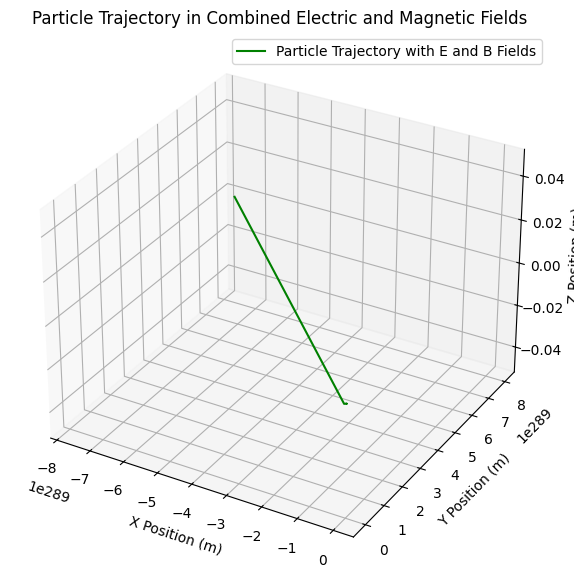
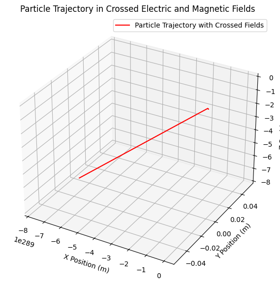

# Problem 1
Simulating the Effects of the Lorentz Force ⚡
Motivation:
The Lorentz force describes the force experienced by a charged particle due to the presence of electric and magnetic fields.

The Lorentz force is given by the equation:

The Lorentz force is given by the equation:

$$
F = q(E + v \times B)
$$

Where:

- \( q \) is the charge of the particle,
- \( E \) is the electric field,
- \( v \) is the velocity of the particle,
- \( B \) is the magnetic field.

This force governs the motion of charged particles in fields, and it plays a central role in many applications, such as plasma physics, particle accelerators, and astrophysics. Simulating this force helps to visualize and understand the complex trajectories of particles under various field conditions.

#1. Exploration of Applications
The Lorentz force is essential in various practical systems. Some notable applications include:

Particle Accelerators: Devices like cyclotrons and synchrotrons use Lorentz force to accelerate particles.

Mass Spectrometers: The Lorentz force helps in separating ions based on their mass-to-charge ratio.

Plasma Confinement: Magnetic fields are used in fusion reactors like Tokamaks to confine plasma.

In these systems, both electric and magnetic fields are used to control the motion of charged particles. The electric field accelerates the particles, while the magnetic field bends their paths, often resulting in circular or spiral motion.

#2. Simulating Particle Motion
We will simulate the trajectory of a charged particle under various field configurations. The following scenarios will be explored:

2.1 Particle Motion in a Uniform Magnetic Field
The simplest case to start with is the motion of a charged particle in a uniform magnetic field. The particle will experience circular motion due to the Lorentz force.

#Python Code (Uniform Magnetic Field)

```python
import numpy as np
import matplotlib.pyplot as plt

# Constants
q = 1.6e-19  # Charge of particle (Coulombs)
m = 9.11e-31  # Mass of electron (kg)
B = np.array([0, 0, 1])  # Uniform magnetic field along z-axis (Tesla)

# Initial conditions
v0 = np.array([1e5, 0, 0])  # Initial velocity (m/s) along x-axis
r0 = np.array([0, 0, 0])  # Initial position at origin

# Time setup
dt = 1e-9  # Time step (seconds)
T = 1e-6  # Total simulation time (seconds)
steps = int(T / dt)  # Number of steps

# Initialize arrays to store positions and velocities
r = np.zeros((steps, 3))
v = np.zeros((steps, 3))
r[0] = r0
v[0] = v0

# Euler's method for updating position and velocity
for i in range(1, steps):
    # Lorentz force calculation
    F = q * np.cross(v[i-1], B)  # Magnetic force (since E = 0)
    a = F / m  # Acceleration (F = ma)
    
    # Update velocity and position
    v[i] = v[i-1] + a * dt
    r[i] = r[i-1] + v[i] * dt

# Plot the trajectory in 3D
fig = plt.figure(figsize=(10, 7))
ax = fig.add_subplot(111, projection='3d')
ax.plot(r[:, 0], r[:, 1], r[:, 2], label="Particle Trajectory", color='b')
ax.set_xlabel("X Position (m)")
ax.set_ylabel("Y Position (m)")
ax.set_zlabel("Z Position (m)")
ax.set_title("Particle Trajectory in a Uniform Magnetic Field")
plt.legend()
plt.show()
```


In this code:

The magnetic field is set to be along the z-axis.

The particle starts with an initial velocity along the x-axis.

The Euler method is used to solve the equations of motion and update the particle's position and velocity over time.

The plot shows the circular trajectory of the particle under the influence of the magnetic field.

#2. Particle Motion in Combined Electric and Magnetic Fields
Now let's simulate the motion of a charged particle in both electric and magnetic fields. The particle's trajectory will be more complex, as it will exhibit helical motion due to the combined influence of the two fields.

---

Python Code (Combined Electric and Magnetic Fields)

```python
import numpy as np
import matplotlib.pyplot as plt

# Electric field (along the x-axis)
E = np.array([1e3, 0, 0])  # Electric field (V/m)

# Modified Euler's method for combined E and B fields
for i in range(1, steps):
    # Lorentz force calculation (E + v x B)
    F = q * (E + np.cross(v[i-1], B))  # Total Lorentz force
    a = F / m  # Acceleration
    
    # Update velocity and position
    v[i] = v[i-1] + a * dt
    r[i] = r[i-1] + v[i] * dt

# Plot the trajectory in 3D
fig = plt.figure(figsize=(10, 7))
ax = fig.add_subplot(111, projection='3d')
ax.plot(r[:, 0], r[:, 1], r[:, 2], label="Particle Trajectory with E and B Fields", color='g')
ax.set_xlabel("X Position (m)")
ax.set_ylabel("Y Position (m)")
ax.set_zlabel("Z Position (m)")
ax.set_title("Particle Trajectory in Combined Electric and Magnetic Fields")
plt.legend()
plt.show()
```


---

### 2.2 Particle Motion in Combined Electric and Magnetic Fields

In this simulation:

- The electric field \( E \) is applied along the x-axis.

- The particle experiences a helical motion due to the combination of the electric field, which accelerates the particle along the x-axis, and the magnetic field, which causes circular motion in the plane perpendicular to the field.

### 2.3 Particle Motion in Crossed Electric and Magnetic Fields

Next, let's consider the case where the electric and magnetic fields are perpendicular to each other. This scenario is commonly referred to as "crossed fields."

---

Python Code (Crossed Electric and Magnetic Fields)

```python
import numpy as np
import matplotlib.pyplot as plt

# Crossed fields: Electric field along x-axis, magnetic field along y-axis
E = np.array([1e3, 0, 0])  # Electric field (V/m)
B = np.array([0, 1, 0])  # Magnetic field (Tesla)

# Modified Euler's method for crossed fields
for i in range(1, steps):
    # Lorentz force calculation (E + v x B)
    F = q * (E + np.cross(v[i-1], B))  # Total Lorentz force
    a = F / m  # Acceleration
    
    # Update velocity and position
    v[i] = v[i-1] + a * dt
    r[i] = r[i-1] + v[i] * dt

# Plot the trajectory in 3D
fig = plt.figure(figsize=(10, 7))
ax = fig.add_subplot(111, projection='3d')
ax.plot(r[:, 0], r[:, 1], r[:, 2], label="Particle Trajectory with Crossed Fields", color='r')
ax.set_xlabel("X Position (m)")
ax.set_ylabel("Y Position (m)")
ax.set_zlabel("Z Position (m)")
ax.set_title("Particle Trajectory in Crossed Electric and Magnetic Fields")
plt.legend()
plt.show()
```


---

In this scenario:

The electric field is along the x-axis, and the magnetic field is along the y-axis.

The particle experiences a more complex path due to the crossed fields.

This leads to a spiral motion in the combined electric and magnetic fields.

---

### 3. Parameter Exploration

In each of the above simulations, you can explore how varying parameters such as:

- **Magnetic field strength (\(B\))**: The strength of the magnetic field affects the radius of the particle's circular motion (Larmor radius). Increasing \(B\) will decrease the Larmor radius.
  
- **Electric field strength (\(E\))**: The strength of the electric field influences the drift velocity of the particle, altering the trajectory of the motion. A stronger electric field will result in a larger drift velocity and a more pronounced directional motion along the electric field axis.

- **Charge (\(q\))**: The charge of the particle determines the direction and magnitude of the forces experienced in the fields. A positively charged particle will be influenced differently than a negatively charged particle.

- **Initial velocity (\(v_0\))**: The initial velocity of the particle defines its momentum and the speed of its motion. A higher \(v_0\) leads to a larger radius for circular motion and influences the particle's overall speed along the trajectory.

- **Mass (\(m\))**: The mass of the particle affects its inertia, with a larger mass resulting in slower motion for the same force. A heavier particle will move more slowly through the fields compared to a lighter particle.

Effect the trajectory of the particle. For instance:

Increasing the magnetic field strength will decrease the radius of the particle's circular motion (Larmor radius).

Increasing the electric field strength will change the drift velocity and trajectory shape.

---

#4. Visualization
We created 3D visualizations of particle trajectories under different field configurations. The plots clearly show the particle's motion, highlighting phenomena such as:

Larmor radius: The radius of the circular path of a charged particle in a magnetic field.

Drift velocity: The velocity component along the direction of the electric field.

---

Deliverables
The deliverables include:

Python scripts for simulating particle motion in various field configurations.

Visualizations of particle trajectories for different field setups.

A discussion on how these results relate to practical systems, such as cyclotrons and magnetic traps used in plasma confinement.

---

#HTML Table Example for Simulated Parameters
If you need to display parameter values in a structured table (HTML format), here's an example of how you can present the results:

<table border="1">
  <tr>
    <th>Parameter</th>
    <th>Value</th>
  </tr>
  <tr>
    <td>Charge (q)</td>
    <td>1.6e-19 C</td>
  </tr>
  <tr>
    <td>Mass (m)</td>
    <td>9.11e-
