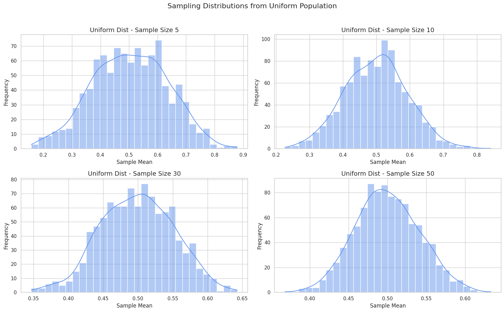

# Problem 1
Exploring the Central Limit Theorem Through Simulations

📌 Motivation
The Central Limit Theorem (CLT) is one of the most important theorems in probability and statistics. It states that, regardless of the shape of the original population distribution, the sampling distribution of the sample mean approaches a normal distribution as the sample size increases. This holds true as long as the population has a finite variance.

In practical terms, the CLT allows us to use normal distribution properties even when the data are not normally distributed. This is a powerful concept, especially in statistical inference, hypothesis testing, and constructing confidence intervals, making it a cornerstone of statistical methodology.

The CLT essentially gives us a way to model the behavior of sample means. When we take multiple samples from any population, no matter its distribution (whether uniform, exponential, binomial, etc.), as the number of observations in each sample increases, the distribution of the sample means will become approximately normal.
\textbf{Central Limit Theorem Statement:}

The Central Limit Theorem can be mathematically expressed as follows:

\[
\text{If } X_1, X_2, \dots, X_n \text{ are i.i.d. random variables with mean } \mu \text{ and variance } \sigma^2, \text{ then:}
\]

\[
\frac{\bar{X}_n - \mu}{\sigma / \sqrt{n}} \xrightarrow{d} \mathcal{N}(0, 1)
\]

Where:
- \( X_1, X_2, \dots, X_n \) are independent and identically distributed (i.i.d.) random variables with mean \( \mu \) and variance \( \sigma^2 \).
- \( \bar{X}_n \) is the sample mean based on a sample of size \( n \).
- As the sample size \( n \) grows, the distribution of the normalized sample mean \( \frac{\bar{X}_n - \mu}{\sigma / \sqrt{n}} \) converges in distribution to the standard normal distribution \( \mathcal{N}(0, 1) \).
### Expected Value and Variance of Sample Mean

The expected value and variance of the sample mean are key to understanding the behavior of \( \bar{X}_n \):

#### **Expected Value:**
The expected value of the sample mean is equal to the population mean, \( \mu \):

\[
\mathbb{E}[\bar{X}_n] = \mu
\]

This means that, on average, the sample mean will be equal to the population mean.

#### **Variance:**
The variance of the sample mean is equal to the population variance divided by the sample size:

\[
\text{Var}(\bar{X}_n) = \frac{\sigma^2}{n}
\]

This shows that as the sample size increases, the variance of the sample mean decreases, leading to more precise estimates of the population mean.

---

### Key Implications of the Central Limit Theorem

#### **1. Large Sample Sizes:**
The CLT tells us that with sufficiently large sample sizes, the sample mean will approximate a normal distribution regardless of the population's original distribution. For example, even if we are drawing samples from a skewed or bimodal distribution, the distribution of the sample mean will become approximately normal as the sample size grows.

#### **2. Practical Use in Inference:**
This property allows statisticians to use the normal distribution to make inferences about a population mean, even when the underlying distribution is unknown or non-normal. It simplifies many statistical techniques, such as confidence intervals and hypothesis testing, since the normal distribution is well-understood and has easily calculable properties.

#### **3. Effect of Sample Size:**
The larger the sample size \( n \), the more closely the sample mean will resemble a normal distribution. However, the rate at which this convergence occurs depends on the population distribution. For populations with high skewness or heavy tails, larger sample sizes may be needed for the sample mean to approximate normality.

---

### Conclusion
The Central Limit Theorem is foundational to statistics and serves as a powerful tool for making inferences about population parameters, especially when dealing with non-normal data distributions. By understanding the behavior of sample means and their relationship to the underlying population, we can apply the principles of the CLT in a wide range of statistical analyses.

🔢 Step 1: Generate Population Distributions
```python
import numpy as np
import matplotlib.pyplot as plt
import seaborn as sns

# Set style
sns.set(style="whitegrid")

# Set seed for reproducibility
np.random.seed(42)

# Population sizes
N = 100_000

# Generate populations
pop_uniform = np.random.uniform(0, 1, N)
pop_exponential = np.random.exponential(1, N)
pop_binomial = np.random.binomial(n=10, p=0.5, size=N)

# Function to get sample means
def sample_means(population, sample_size=30, n_samples=1000):
    means = []
    for _ in range(n_samples):
        sample = np.random.choice(population, size=sample_size, replace=False)
        means.append(np.mean(sample))
    return np.array(means)

# Function to plot the sampling distribution
def plot_sampling_distribution(population, name, sample_sizes=[5, 10, 30, 50]):
    plt.figure(figsize=(16, 10))
    for i, size in enumerate(sample_sizes, 1):
        means = sample_means(population, sample_size=size)
        plt.subplot(2, 2, i)
        sns.histplot(means, kde=True, bins=30, color="cornflowerblue")
        plt.title(f"{name} Dist - Sample Size {size}", fontsize=14)
        plt.xlabel("Sample Mean")
        plt.ylabel("Frequency")
    plt.suptitle(f"Sampling Distributions from {name} Population", fontsize=16)
    plt.tight_layout(rect=[0, 0, 1, 0.96])
    plt.show()

# Plot sampling distributions for each population
plot_sampling_distribution(pop_uniform, "Uniform")
plot_sampling_distribution(pop_exponential, "Exponential")
plot_sampling_distribution(pop_binomial, "Binomial")

```


📋 Step 2: HTML Table of Population Statistics
<table border="1">
  <tr>
    <th>Distribution</th>
    <th>Mean (μ)</th>
    <th>Variance (σ²)</th>
  </tr>
  <tr>
    <td>Uniform [0, 1]</td>
    <td>0.5</td>
    <td>1/12 ≈ 0.083</td>
  </tr>
  <tr>
    <td>Exponential(λ=1)</td>
    <td>1.0</td>
    <td>1.0</td>
  </tr>
  <tr>
    <td>Binomial(n=10, p=0.5)</td>
    <td>5.0</td>
    <td>2.5</td>
  </tr>
### 🧠 Step 6: Interpretation

As the sample size increases, the shape of the sampling distribution of the mean approaches normality.

This effect occurs even if the original population is skewed or non-normal (e.g., exponential).

The variance of the sample mean decreases as the sample size increases:

\[
\text{Var}(\bar{X}) = \frac{\sigma^2}{n}
\]

🎯 Applications
Quality control: Predict deviations in manufactured goods.

Financial modeling: Estimate expected returns from historical data.

Medical studies: Determine treatment effectiveness based on sample averages.

