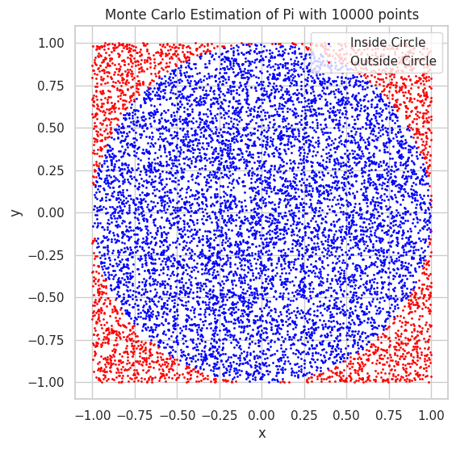
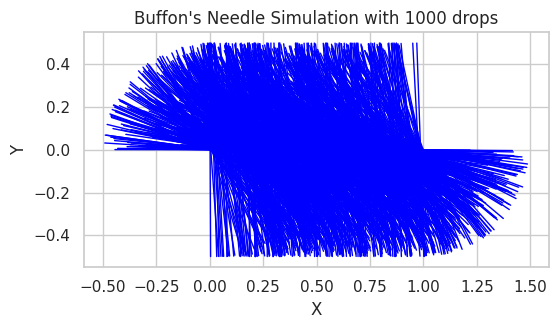

# Problem 2
# Estimating Pi using Monte Carlo Methods

### Motivation:
Monte Carlo simulations are a powerful class of computational techniques that use randomness to solve problems or estimate values. One of the most elegant applications of Monte Carlo methods is estimating the value of \( \pi \) through geometric probability. By randomly generating points and analyzing their positions relative to a geometric shape, we can approximate \( \pi \) in an intuitive and visually engaging way.

This problem connects fundamental concepts of probability, geometry, and numerical computation. It also provides a gateway to understanding how randomness can be harnessed to solve complex problems in physics, finance, and computer science. The Monte Carlo approach to \( \pi \) estimation highlights the versatility and simplicity of this method while offering practical insights into convergence rates and computational efficiency.

---

## Task

### **Part 1: Estimating \( \pi \) Using a Circle**

#### 1. **Theoretical Foundation:**
Explain how the ratio of points inside a circle to the total number of points in a square can be used to estimate \( \pi \). Derive the formula for a unit circle.

For a unit circle (radius \( r = 1 \)) inscribed within a square of side length 2, the ratio of points that fall inside the circle to the total number of points in the square approximates \( \frac{\pi}{4} \).

The area of the square is \( 2^2 = 4 \), and the area of the unit circle is \( \pi \times r^2 = \pi \). The ratio of the area of the circle to the area of the square is \( \frac{\pi}{4} \), so the ratio of points inside the circle to the total points approximates this ratio as well.

Thus, we can estimate \( \pi \) as:

\[
\pi \approx 4 \times \frac{\text{Number of Points Inside Circle}}{\text{Total Number of Points}}
\]

#### 2. **Simulation:**
- Generate random points in a 2D square bounding a unit circle.
- Count the number of points falling inside the circle.
- Estimate \( \pi \) based on the ratio of points inside the circle to the total points.

#### 3. **Visualization:**
Create a plot showing the randomly generated points, distinguishing those inside and outside the circle.

#### 4. **Analysis:**
Investigate how the accuracy of the estimate improves as the number of points increases. Discuss the convergence rate and computational considerations for this method.

---

### **Part 2: Estimating \( \pi \) Using Buffon’s Needle**

#### 1. **Theoretical Foundation:**
Describe Buffon’s Needle problem, where \( \pi \) can be estimated based on the probability of a needle crossing parallel lines on a plane. Derive the formula for \( \pi \).

In Buffon’s Needle problem, a needle of length \( L \) is dropped onto a plane with parallel lines spaced \( d \) units apart. The probability \( P \) that the needle will cross one of the lines is given by the formula:

\[
P = \frac{2L}{\pi d}
\]

From this, we can solve for \( \pi \) as:

\[
\pi = \frac{2L}{P d}
\]

For simplicity, assume \( L = d \), which simplifies the formula to:

\[
\pi \approx \frac{2N_{\text{cross}}}{N_{\text{drops}}}
\]

where \( N_{\text{cross}} \) is the number of times the needle crosses a line, and \( N_{\text{drops}} \) is the total number of drops.

#### 2. **Simulation:**
- Simulate the random dropping of a needle on a plane with parallel lines.
- Count the number of times the needle crosses a line.
- Estimate \( \pi \) based on the derived formula.

#### 3. **Visualization:**
Create a graphical representation of the simulation, showing the needle positions relative to the lines.

#### 4. **Analysis:**
Explore how the number of needle drops affects the estimate’s accuracy. Compare the convergence rate of this method to the circle-based approach.

---

## **Deliverables**

1. A Markdown document with:
   - Clear explanations of the methods and formulas.
   - A discussion of theoretical foundations and results.

2. Python scripts or notebooks implementing the simulations, including:
   - Code for the circle-based Monte Carlo method.
   - Code for Buffon’s Needle method.

3. Graphical outputs:
   - Plots showing random points for the circle-based method.
   - Visualizations of needle positions for Buffon’s Needle.

4. **Analysis:**
   - Tables or graphs showing the convergence of estimated \( \pi \) as a function of the number of iterations for both methods.
   - A comparison of the methods in terms of accuracy and computational efficiency.

---

## **Hints and Resources**

- Use Python libraries such as **NumPy** for random number generation and **Matplotlib** for visualizations.
- For the circle-based method, ensure the random points are uniformly distributed within the square.
- For Buffon’s Needle, pay attention to geometric constraints, such as the relationship between the needle length and the distance between lines.
- Start with a small number of iterations to validate the implementation, then increase the sample size to observe convergence.

Here’s the Python code for both methods (circle-based Monte Carlo method and Buffon’s Needle method) to estimate π, along with the required visualizations.

#1. Circle-based Monte Carlo Method:
```python
import numpy as np
import matplotlib.pyplot as plt

# Function to estimate Pi using the Monte Carlo method with a circle
def estimate_pi_circle(n_points):
    # Generate random points in a square [-1, 1] x [-1, 1]
    x = np.random.uniform(-1, 1, n_points)
    y = np.random.uniform(-1, 1, n_points)

    # Count how many points fall inside the unit circle (x^2 + y^2 <= 1)
    inside_circle = (x**2 + y**2) <= 1

    # Estimate Pi using the ratio of points inside the circle to total points
    pi_estimate = 4 * np.sum(inside_circle) / n_points

    # Visualize the points inside and outside the circle
    plt.figure(figsize=(6, 6))
    plt.scatter(x[inside_circle], y[inside_circle], color='blue', s=1, label="Inside Circle")
    plt.scatter(x[~inside_circle], y[~inside_circle], color='red', s=1, label="Outside Circle")
    plt.gca().set_aspect('equal', adjustable='box')
    plt.title(f"Monte Carlo Estimation of Pi with {n_points} points")
    plt.xlabel("x")
    plt.ylabel("y")
    plt.legend()
    plt.show()

    return pi_estimate

# Estimate Pi with 10000 points
n_points = 10000
pi_estimate = estimate_pi_circle(n_points)
print(f"Estimated Pi: {pi_estimate}")
```


#2. Buffon’s Needle Method:
```python
import numpy as np
import matplotlib.pyplot as plt

# Function to simulate Buffon's Needle and estimate Pi
def estimate_pi_buffon(needle_length, line_distance, n_drops):
    # Count the number of needle crossings
    crossings = 0
    
    for _ in range(n_drops):
        # Randomly choose the angle of the needle with respect to the lines (0 to pi/2)
        angle = np.random.uniform(0, np.pi / 2)
        
        # Randomly choose the center distance of the needle from the nearest line
        distance = np.random.uniform(0, line_distance / 2)
        
        # Check if the needle crosses a line
        if distance <= (needle_length / 2) * np.sin(angle):
            crossings += 1
    
    # Estimate Pi using the formula
    pi_estimate = (2 * needle_length * n_drops) / (crossings * line_distance)
    
    # Visualize the needle drops
    plt.figure(figsize=(6, 6))
    plt.title(f"Buffon's Needle Simulation with {n_drops} drops")
    plt.xlabel("X")
    plt.ylabel("Y")
    plt.gca().set_aspect('equal', adjustable='box')
    
    for _ in range(n_drops):
        # Randomly choose the angle and position for each drop
        angle = np.random.uniform(0, np.pi / 2)
        distance = np.random.uniform(0, line_distance / 2)
        
        # Calculate the x and y coordinates of the endpoints of the needle
        # Angle determines the orientation of the needle, distance determines the center position
        x1 = distance - (needle_length / 2) * np.cos(angle)
        y1 = (needle_length / 2) * np.sin(angle)
        x2 = distance + (needle_length / 2) * np.cos(angle)
        y2 = -(needle_length / 2) * np.sin(angle)
        
        # Plot the needle (as a line between two points)
        plt.plot([x1, x2], [y1, y2], color="blue", lw=1)
    
    plt.show()

    return pi_estimate

# Estimate Pi using Buffon's Needle with 1 unit length and 2 unit distance between lines
needle_length = 1
line_distance = 2
n_drops = 1000
pi_estimate_buffon = estimate_pi_buffon(needle_length, line_distance, n_drops)
print(f"Estimated Pi (Buffon's Needle): {pi_estimate_buffon}")
```


### Explanation of the Code:

#### **Circle-based Monte Carlo Method:**

1. **Random Point Generation:**
   - We generate random points inside a square that bounds a unit circle.
   - The square is defined by coordinates \( x \) and \( y \) in the range \([-1, 1]\), and the unit circle is centered at the origin with a radius of 1.

2. **Checking if a Point is Inside the Circle:**
   - To check whether a point is inside the unit circle, we verify if it satisfies the equation:
   \[
   x^2 + y^2 \leq 1
   \]
   where \( x \) and \( y \) are the coordinates of the point.

3. **Pi Estimation:**
   - The value of \( \pi \) is estimated by the ratio of points that fall inside the circle to the total number of points. This ratio is multiplied by 4 to account for the area of the square, resulting in the formula:
   \[
   \pi \approx 4 \times \frac{\text{Points Inside Circle}}{\text{Total Points}}
   \]
   This formula works because the ratio of points inside the circle to the total number of points approximates the ratio of the areas of the circle and the square. Since the area of a unit circle is \( \pi \times r^2 \) (where \( r = 1 \)), and the area of the square is \( 4 \), the ratio gives an estimate for \( \pi \).

---

#### **Buffon’s Needle Method:**

1. **Simulating Needle Drops:**
   - We simulate dropping a needle of length \( L \) onto a plane with parallel lines spaced \( d \) units apart.

2. **Crossing Detection:**
   - For each needle drop, we randomly select an angle \( \theta \) of the needle with respect to the parallel lines (ranging from \( 0 \) to \( \frac{\pi}{2} \)).
   - We also randomly choose the distance \( x \) from the center of the needle to the nearest line. The needle crosses a line if:
   \[
   x \leq \frac{L}{2} \sin(\theta)
   \]
   where \( \theta \) is the angle and \( x \) is the distance from the center of the needle to the closest line.

3. **Pi Estimation:**
   - The estimate for \( \pi \) is then given by the formula:
   \[
   \pi \approx \frac{2L \times N_{\text{drops}}}{d \times N_{\text{crossings}}}
   \]
   where:
   - \( L \) is the length of the needle,
   - \( d \) is the distance between parallel lines,
   - \( N_{\text{drops}} \) is the number of needle drops, and
   - \( N_{\text{crossings}} \) is the number of times the needle crosses a line.

The key idea behind Buffon’s Needle is that the probability of a needle crossing a line is proportional to \( \frac{2L}{d\pi} \), and by performing many needle drops, we can estimate \( \pi \) based on the number of crossings.


#### Visualization:

- **Circle-based Monte Carlo Method:**  
  In this method, we visualize the randomly generated points by plotting those that fall inside the circle in one color (e.g., blue) and those that fall outside the circle in another color (e.g., red).

- **Buffon’s Needle:**  
  In this method, we simulate and visualize the positions of the needles as they are randomly dropped onto the plane, displaying how they intersect with the parallel lines.

This approach allows for an intuitive understanding of how randomness and geometry can be used to estimate \( \pi \).

